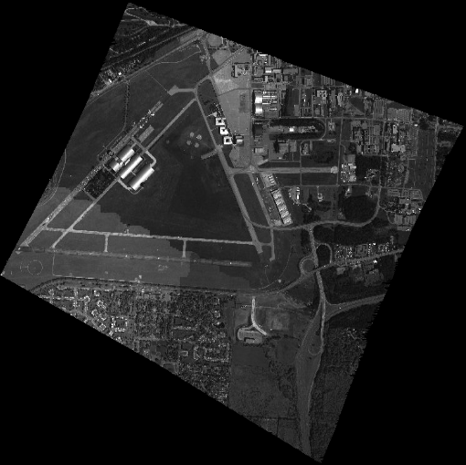

# UNICORN 2008 Dataset Overview

UNIfied COincident Optical and Radar for recognitioN (UNICORN).

## Overview

The UNICORN 2008 dataset is a multi-modality, partially truthed, simultaneous
and coincident dataset, using both a Wide Area Motion Imagery (WAMI) large 
format electro-optical (EO) sensor, and Wide Area Synthetic Aperture Radar 
(SAR).


The data was collected over Wright-Patterson Air Force Base using the 
GOTCHA/NDU radar, and similar sensor to what was used for the [CLIF 2007 data
collection](https://github.com/AFRL-RY/data-clif-2007). The EO data was 
manually truthed, and GPS ground truth is provided for some targets as well. 
Targets consist of various cars and trucks, along with radar reflectors. and
other calibration targets.

In 2008, the DCS radar was modified to achieve a 5 km diameter spot, while 
maintaining radar resolution and sensitivity. In August 2008, AFRL performed 
a data collection with the modified DCS radar along with EO WAMI asset.
A fleet of 25 civilian vehicles were deployed at various locations. Finally,
a set of 12 large quad-corner reflectors were distributed across the 5 km spot. 
The location of each stationary vehicle and calibration target was recorded 
using differential GPS.  Over 12 million labels are provided in the WAMI EO 
data.

## Airborne Sensor Hardware

### EO

The EO sensor is a large format monochromatic electro-optical sensor comprised
of a matrix of six cameras. The cameras, for this data collection, collect data
at approximately 2 frames per second.  Only geo-projected NITF files are
available from this data collection, no raw files were collected.

Sample Image:



Each camera was made by Illunis employing a Kodak KAI-11002 charge coupled
device (CCD).  The optics are Canon 135 MM EF mount lens controlled with
a Birger adapter.  Unfortunately both the CCD and camera have been discontinued.
On the rear of the camera head was a Novatel DL4 Plus SPAN with a Honeywell
HG1700_AG11 inertial measurement unit (IMU).   The entire integrated system
is shown below.


### SAR

The Gotcha/NDU Antenna Set consists of the Standard NDU antenna set (three white dual-polarized parabolic
dish antennas) plus two Trifurcated Horn antennas mounted between the center and outer NDU antennas.
the antennas are cabled/plubmed to the radar to allow Gotcha operation (5km swath HH polarization through
the horn antennas) and NDU multi-phase center (~1 KM swath H and V polarization) operation on a pass-by-pass
basis.


## Coincident Information
All the data in question was collected on 2008-08-16. 

### Temporal Overlap
The SAR NITFs go from 14:33:02 UTC to 15:16:55 UTC. 
The EO NITFs go from 14:41:40 UTC to 16:36:14 UTC.

Therefore, we have data for both sensors from 14:41:40 UTC to 15:16:55 UTC.

### Geographical Overlap

The EO coverage moves around quite a bit, but seems centered on the 
southeast corner of the Wright-Patterson Air Force Base Area B runway triangle.
The SAR coverage forms a square, steady swath, exactly 5kmX5km,
apparently also centered on the southeast corner of the runway. Targets near
the corner at 39.7760017, -84.0976938 should be visible in both modalities. 

This was confirmed by inspecting via Pursuer: 

EO/SAR images of Nissan Altima at ground station:


EO/SAR images of Nissan Altima on runway:


Viewing remote sensing data with a high update rate can be a challenge 
additionally the UNICORN data set has two sensor streams, a remote 
sensing viewer that can visualziae both sensor streams of the UNICORN 
data with considertation for temporal aspects is Pursuer version 2.4.
Pursuer is available at the FOUO DIST C level.  

EO/SAR overlaid together in Pursuer [click for full resolution](images/UnicornScreen1_full_res.png):


EO/SAR overlaid together in Pursuer higher resolution [click for full resolution](images/UnicornScreen2_full_res.png):


EO/SAR overlaid together in Pursuer highest resolution [click for full resolution](images/UnicornScreen3_full_res.png):


## Unicorn 2008 Data Products

- EO NITF Image data, (~70 GB).
- SAR NITF Image data (300+ GB), formed with backprojection.
- Ground Truth using GPS
- WAMMIT Truth database for EO data

### NITF Data

[National Image Transmission Format (NITF)](https://en.m.wikipedia.org/wiki/National_Imagery_Transmission_Format)
is the DoD standard for imagery. Bascially a NITF file is a large
header with the data concatenated onto the rear of the file.  The data
or image  is stored in blocks of jpeg 6.2 compressed images of 128 x 128 size. The
easiest way to read NITF data is to use 
[Geospatial Data Abstraction Layer (GDAL)](https://en.m.wikipedia.org/wiki/GDAL). 
Example Python code is provided [code/NITFPythonGDAL.py](code/NITFPythonGDAL.py) that will
read the NITF file then plot the image in a matplotlib plot.

#### NITF File Naming Convention

The NITF files are named as "YYYYMMDDHHMMSS-FNXXXXXX-VIS.ntf.r0", where FN is the
flight number and XXXXXX is the frame number, an example file name is
"20071028142730-01000324-VIS.ntf.r0". On close inspection of the NITF data you
will notice that each of the NITF files have six correpsonding files each with
r0, r1, r2, r3, r4, and r5.  Those files represent the resolution set also
known as the r set.  The highest resolution is r0 while the lowest resolution is r5.

#### NITF Storage
The NITF files are stored in standard "tarballs" in Amazon S3 requester pay
buckets at s3://sdms-unicorm-2008.
See the [bulk data access section](#bulk_data_access) at the end of mark down file
for instructions on how to download the NITF imagery.

## GPS Ground Truth
GPS ground truth is provided for 11 targets that were present on the day of the 
data collection:

* 1992 Chevy Blazer
* 2000 Dodge Durango
* 2001 F150 SuperCrew Pick Up Truck
* 2000 Ford Windstar
* 2002 Honda Accord
* 2005 Hyundai Sonata
* "Kidnap Dismount"
* 2004 Yamaha XVS 650 Motorcycle
* 2007 Nissan Altima
* 2007 Saturn Ion
* 2002 Subaru Station Wagon

### GPS Ground Truth Data Format

For each target a single comma sperated value (CSV) with the first line containing
description of the fields is provided. These labels are provided in the data set and stored in 
s3://sdms-unicorn-2008/20080816_UNICORN_GPS_Ground_Truth.zip. Example GPS 
Ground Truth Data is provided below:

```bash
Status, Latitude(DecDegrees), RefrncDirctn, Longitude(DecDegrees), RefrncDirctn, TimeUTC(hhmmss), Date(ddmmyy), Speed(mph), Heading(True), AltitudeMSL(ft), HDOP, Satellites, ,SatusA= ,valid_data ,GPS_ok
4,39.78656206,N,84.10331385,W,140009,160808,0.003163506,84.62161,792.1587927,1.23,7,,,,
4,39.78656204,N,84.10331384,W,140010,160808,0.005001942,84.63015,792.1358268,1.23,7,,,,
4,39.78656205,N,84.10331385,W,140011,160808,0.002236936,84.68801,792.1489501,1.23,7,,,,
```

## Truth/Labels/Tracks

A variety of objects in the scene were tracked and truthed (or labeled) by humans. 
These labels are provided in the data set and stored in 
s3://sdms-unicorn-2008/20080816_UNICORN_truth.zip. The truth data was generated with 
AFRL Sensor Directorate's WAMITT tool and is provided in a MySQL dump text file. 
The relational database structure is shown in 
[WAMITT relational DB design](images/wamittEr_v2.png). Truth or labels were 
derived from the NITF EO files.

### MySQL Tracks to sqlite3

Sqlite3 is easier to work with for some users because sqlite3 does not require 
a server install of the MySQL database. To convert from MySQL dump sql file format
to sqlite3 see the [script on github](https://github.com/dumblob/mysql2sqlite).
The labels in sqlite3 database format are stored 
s3://sdms-unicorn-2008/20080816_UNICORN_truth_sqlite3.zip. An example command to
convert the WAMITT tracks is:

```bash
./mmysql2sqlite wamitt_gotcha_v01.sql | sqlite3 wamitt_gotcha_v01.db
./mmysql2sqlite wamitt_gotcha_v02.sql | sqlite3 wamitt_gotcha_v02.db
./mmysql2sqlite wamitt_gotcha_v03.sql | sqlite3 wamitt_gotcha_v03.db
./mmysql2sqlite wamitt_gotcha_v04.sql | sqlite3 wamitt_gotcha_v04.db
./mmysql2sqlite wamitt_gotcha_v05.sql | sqlite3 wamitt_gotcha_v05.db
```

### CSV file of the labels


In addition to the MySQL data dump file we have taken the liberty to
convert the file into a single comma separated value (CSV) file to ease
processing of the truth file. The CSV file is stored here
s3://sdms-unicorn-2008/20080816_UNICORN_truth_csv.zip.  The
script [code/convert_sqlite3_to_csv.py](code/convert_sqlite3_to_csv.py) was used
to convert the SQLite3 database to CSV.  It is an easily modifiable script in
case your research requires additional fields. The CSV file includes the field
names on the first line of the file.  A snippet of the CSV file is included
below:

```bash
track_point.fileId,track_point.time,track_point.frame,track.id,track_point.id,target_type.name,color.color,track.length,track.width,track_point.x,track_point.y,track_point.latitude,track_point.longitude
NITFVIS2008081614414001004700,1218897700350,4700,7743,15924061,SUV,gray,4.82,1.77,9216,2935,39.7844829464586,-84.0886010810624
NITFVIS2008081614414001004701,1218897700790,4701,7743,15924071,SUV,gray,4.82,1.77,9224,2933,39.7844914764619,-84.0885647941102
NITFVIS2008081614414101004702,1218897701310,4702,7743,15924075,SUV,gray,4.82,1.77,9133,3035,39.7844956265658,-84.0885370489355
NITFVIS2008081614414101004703,1218897701840,4703,7743,15924076,SUV,gray,4.82,1.77,9048,2875,39.7845246616604,-84.088486115833
```

## Truth/Label Statistics

The Python code code/truth_stats.py was used to generate the statistics for the truth/label data below.

* Total number of images with truth data: 6,471
* Total count of objects truthed: 12,766,950
	* The count of each object type
		* SUV: 1,248,213
		* SUV w/trailer: 19,445
		* bicycle: 936
		* boat: 236
		* box truck: 88,486
		* bus: 38,243
		* dismount: 6,627
		* dump truck: 2,398
		* flatbed truck: 20,880
		* flatbed truck w/trailer: 4,697
		* motorcycle: 55,122
		* other: 113,271
		* pickup truck: 589,348
		* pickup truck w/trailer: 35,163
		* plane: 19,269
		* sedan: 9,912,570
		* sedan w/trailer: 15,300
		* semi: 21,270
		* semi w/trailer: 40,085
		* van: 531,646
		* van w/trailer: 3,745

Due to the difficulties with tracking moving objects in SAR a large amount of 
parked vehicles was truthed in the UNICORN data set.

## <a name="bulk_data_access"></a> Bulk Data Access - Amazon S3
<!-- This section is based on http://arxiv.org/help/bulk_data_s3 -->

The UNICORN 2008 data is available from Amazon
Simple Storage Service (S3) in Requester Pays buckets (i.e., you are charged
by Amazon to access, browse, and download this data). Please see
<a href="http://docs.aws.amazon.com/AmazonS3/latest/dev/RequesterPaysBuckets.html">Requester Pays Buckets</a> in the <a href="http://docs.amazonwebservices.com/AmazonS3/latest/dev/">Amazon S3 Guide</a> for
more information on this service. Your use of Amazon S3 is subject to Amazon's
Terms of Use. The accessibility of SDMS data from Amazon S3 is provided "as is"
without warranty of any kind, expressed or implied, including, but not limited
to, the implied warranties of merchantability and fitness for a particular use.
Please do not contact SDMS for assistance with Amazon services, you can post
a GitHub issue and the authors will try and assist.

The name of the S3 bucket is s3://sdms-unicorn-2008/

### Tools

We do not track development of tools interacting with Amazon S3, nor endorse any
particular tool.  However, in development of this facility we found the Python
package <a href="http://s3tools.org/s3cmd">s3cmd</a> to be useful on Mac OS X
and Linux.  For Windows the AWS team provided the following suggestions
<a href="http://s3browser.com/requester-pays-buckets.php">s3browser.com</a> and
<a href="http://www.crossftp.com/amazon-s3-client.htm">cross ftp</a>.

### s3cmd Example

The examples shown below were developed and tested with Linux and Mac OS X
using the Python distribution of Enthought Canopy.  First you must  <a
href="http://docs.aws.amazon.com/AmazonS3/latest/gsg/SigningUpforS3.html">
establish a AWS account</a> and download your AWS_ACCESS_KEY_ID and
AWS_SECRET_ACCESS_KEY. Next use the following commands to export your key id and
secret access key to the shell environment replacing the values of
AWS_ACCESS_KEY_ID and AWS_SECRET_ACCESS_KEY with the values from your newly
established AWS account:

```bash
export AWS_ACCESS_KEY_ID="JSHSHEUESKSK65"
export AWS_SECRET_ACCESS_KEY="kskjskjsAEERERERlslkhdjhhrhkjdASKJSKJS666789"
```

Install s3cmd with pip:

```bash
pip install s3cmd
```

To list the directory of the sdms-unicorn-2008 bucket use the following command:

```bash
s3cmd --requester-pays ls s3://sdms-unicorn-2008/
```

Please note all the UNICORM 2008 data products are in a single directory.

To determine the amount of disk space in the sdms-unicorn-2008 bucket use the command:

```bash
s3cmd --requester-pays --recursive --human du s3://sdms-unicorn-2008/
```

To retrieve a file:

```bash
s3cmd --requester-pays get s3://sdms-unicorn-2008/position_text.tar.gz
```

We do not recommend that you use s3cmd sync capability because the number of
files and size of the UNICORN data set is large and errors will result.

### Optimizing Data Download Costs

The UNICORN 2008 data set is large at approximately 394 GB, to download the entire
data set it would cost $35.46. This assumes AWS download fees are $0.09 a gigabyte.

This does not include the raw SAR phase history, which is in the range of ~4TB.
Downloading this would cost ~$360.

If you wish to acquire the raw phase history, please create an issue.

Most researchers will not require the entire UNICORN 2008 data set, carefully
consider the data that you require to meet your research needs and download
costs.  We have divided the dataset into small tarballs to make the download
easier and to make it possible for a researcher to select the data they need.
For instance raw images can be downloaded by camera number and NITF files
can be downloaded by flight number.  Much smaller index files have been
provided that lists the file name and size of each file contained in the
tarballs. We attempted to maintain a careful balance between tarball size
and number of tarball files.  Obviously the smaller the tarball file the
more tarball files that would have to be created.


## Updates

Please feel free to create a pull request or new issue if you write a paper
that uses this data set so we can update the bibliography.  In addition we will
gladly accept pull requests and new issues for corrections or bug fixes.

## Acknowledgments

Todd Rovito and Olga Mendoza-Schrock were supported under an AFOSR grant in
[Dynamic Data Driven Application Systems](http://www.1dddas.org).

## Citation
When reporting results that use the Unicorn 2008 dataset, please cite:

Colin Leong<sup>2</sup>, Todd Rovito<sup>1</sup>, Olga Mendoza-Schrock<sup>1</sup>,
Jason Bowser<sup>2</sup>, Linda Moore<sup>1</sup>, Steve Scarborough<sup>1</sup>, 
Michael Minardi<sup>3</sup>, David Hascher<sup>4</sup>. Unified Coincident 
Optical and Radar for Recognition (UNICORN) 2008 Dataset. 
https://github.com/AFRL-RY/data-unicorn-2008, 2019

1. AFRL/Sensors Directorate/RYA 2241 Avionics Circle, Wright-Patterson AFB, Ohio 45433
2. University of Dayton Research Institute (UDRI), 300 College Park, Dayton, Ohio 45469 
3. Matrix Research Inc 1300 Research Park Dr, Beavercreek, Ohio 45432
4. Applied Research Solutions 51 Plum St. Suite 240 Bevercreek, Ohio 45440

## Copyright information

This page and data set is in the public domain under [17 U.S.C. 105](https://www.law.cornell.edu/uscode/text/17/105).

## Bibliography

